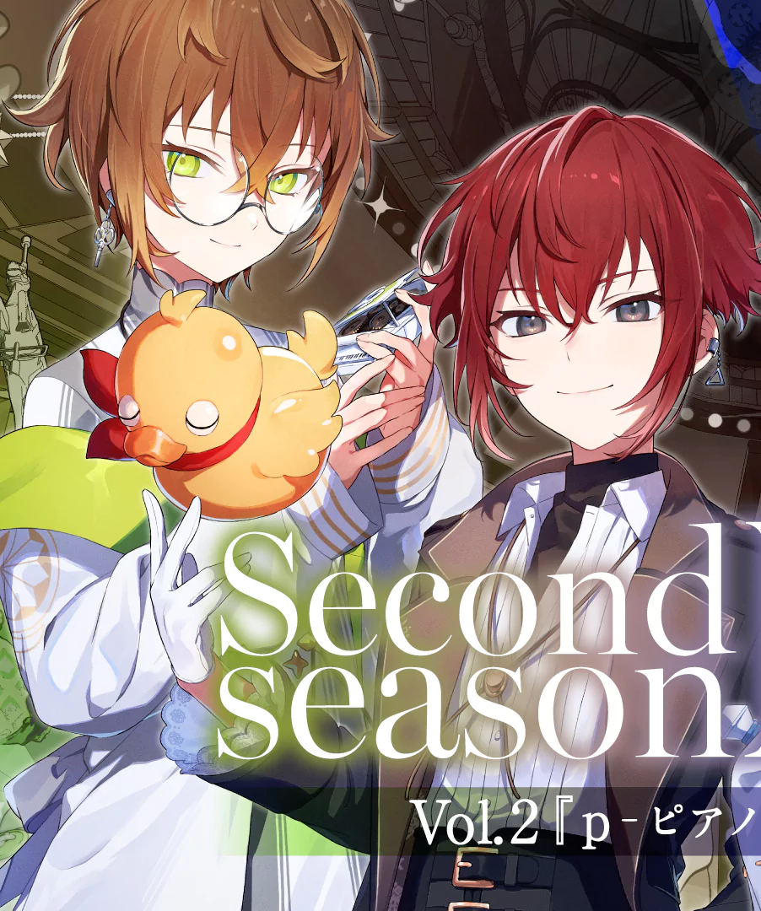

# 【圈外人也能看懂的 CLQST 310cb 向安利】绝症组友谊绝赞众筹中 🎉

# 食用说明

本文是 **CLQST 小豆泽三斗&不破十纪人 cb 向安利条**，全文传送→<a href="https://c-sharp123.github.io/310cbintro/#/" target="_blank">🌙</a>

~~(绝症组你们冷到让一个从来不会安利东西的人硬是搓了个安利条，实力)~~

 
图源：黑叉官号 Clock over ORQUESTA（クロケスタ）公式（@ClQST_info）

\*注：

- 因力图做到即便是对 CLQST 企划一无所知的朋友也能快速了解，所以下面对情节和人物形象的概述会比较宽泛和扁平。

- 角色和角色间关系更细微特别以及值得深挖的地方建议还是去翻原作细品，诚挚邀请各位一起无中生有绝症组友谊 ♩

- 本文含 [原作介绍](./docs/README.md/#原作介绍)/[角色介绍](./docs/README.md/#角色介绍)/[原作关系概括](./docs/README.md/#原作关系概括)/[角色关系萌点](./docs/README.md/#角色关系萌点)/[补习指南](./docs/README.md/#补习指南)，可按需阅读。

  - <i style="color:#7f8c8d;">由于此安利条作者还看不太懂结局（即【all for one】篇章之后）的操作，所以下边所述内容基本是在描述三轮战斗开始前绝症组的关系状态。</i>

  - <i style="color:#7f8c8d;">追加：主线完结后此安利条作者对绝症组互动关系的主观理解：[10 是如何暂时打断 3 的创伤循环的？](/c2.md)</i>

> ⚠️ <b>含【大 量 剧 透】</b>。

> ❗️ <b>请勿将此文档链接及文档内任何内容（尤其【补习指南】部分）以任何形式转载、发布于海外 SNS 平台（如 X、Instagram、Facebook、TikTok 等）。</b>

 
 
 
 

# 版权声明

此文档内容由个人爱好者出于兴趣及分享目的制作，**完全非营利**，内容旨在更好地对 CLQST 企划及相关角色（小豆泽三斗&不破十纪人）进行介绍说明。

1. **所使用的图片素材来源及使用说明：**

- **图片来源：**
   此文档所使用的图片素材来源于以下官方渠道：
  - 「Clock over ORQUESTA」官方网站 →https://clockoverorquesta.com/
  - 「Clock over ORQUESTA」官方 X (Twitter) 账号 →[Clock over ORQUESTA（クロケスタ）公式（@ClQST_info）](https://x.com/ClQST_info/)
  - 「Clock over ORQUESTA」官方 YouTube 账号 →[Clock over ORQUESTA（@ClockoverORQUESTA）](https://www.youtube.com/@ClockoverORQUESTA)
  - 「Clock over ORQUESTA」官方 bilibili 账号 →[CLQST\_官方账号](https://space.bilibili.com/1759069692)

对于来自「Clock over ORQUESTA」官方网站 （URL：`https://clockoverorquesta.com/`）的图片素材，**严格遵守官方二次创作指南的要求，声明来源和使用禁止事项：**

> **当ページは「Clock over ORQUESTA」オフィシャルサイト（URL：`https://clockoverorquesta.com/`）の画像を利用しております。該当画像の再利用(転載・配布等)は禁止しております。** 
> （本页面使用了「Clock over ORQUESTA」官方网站（URL：`https://clockoverorquesta.com/`）的图片。相关图片禁止再次使用（转载、二次分发等）。）

- **版权归属：**

所有原始图片、视频截图及其所包含的角色形象、设计元素等，其著作权及其他知识产权均归属于原作者及版权方<b>viviON enter / viviON, inc.</b>所有。

- **加工说明：**

部分原始素材在此文档中经过了**裁剪和添加非官方中文字幕**的二次加工，仅用于辅助说明和介绍目的。

  - **裁剪：** 仅限于为突出展示特定内容或适应排版需要的尺寸调整。

  - **字幕：**所有字幕文本均基于官方发布的日语内容**通过机器翻译软件生成**。本人**不懂日语**，无法确保翻译的绝对准确性，字幕**仅供参考大意，并非官方译本。**

2. <b class="mark">文档内容传播限制 ⚠：</b>

此文档内容（包括文字说明、图片素材及整合的非官方汉化资源信息）仅限中文互联网环境下的爱好者交流与学习参考用，**暂不授权任何国内社交媒体平台（包括但不限于小红书，bilibil，微博，QQ 空间等）转载**，还请理解。

<b class="mark">严禁将本文档链接以及文档内全部或部分内容（尤其涉及非官方汉化资源信息的【补习指南】部分）转载、上传或分享至任何海外社交媒体平台（包括但不限于 X、Instagram、Facebook、TikTok 等）。</b>

3. **免责声明：**

本声明旨在表明对官方版权的尊重及遵循相关指引[《二次創作についてのガイドライン》](https://enter.vivion.jp/guidelines/)（URL：`https://enter.vivion.jp/guidelines/`）的意愿。

**本人深知此声明不能完全免除潜在的侵权责任。**本内容无意侵害官方任何权益，亦非官方授权作品，如版权方认为内容存在不妥而需下架，请通过邮箱 <c-sharp123@outlook.com> 联系，本人将立即配合处理。
 
 
 
 

# 问题反馈/联系作者

若文档因版权问题需下架/有bug/所表述的内容有误/引用的剧情音声内容或账号传送链接需更新或删除，请联系此文档作者进行处理：

- ✉️→<c-sharp123@outlook.com>

    