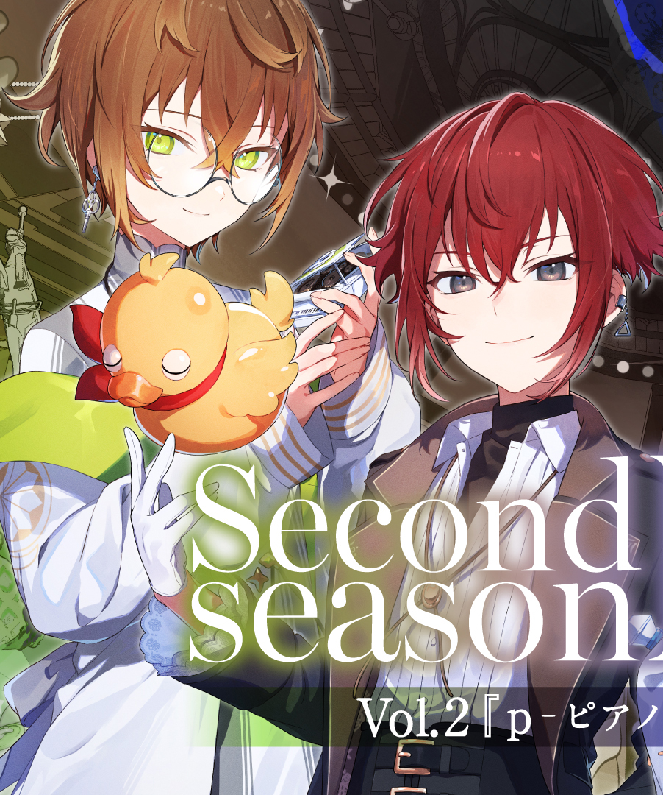
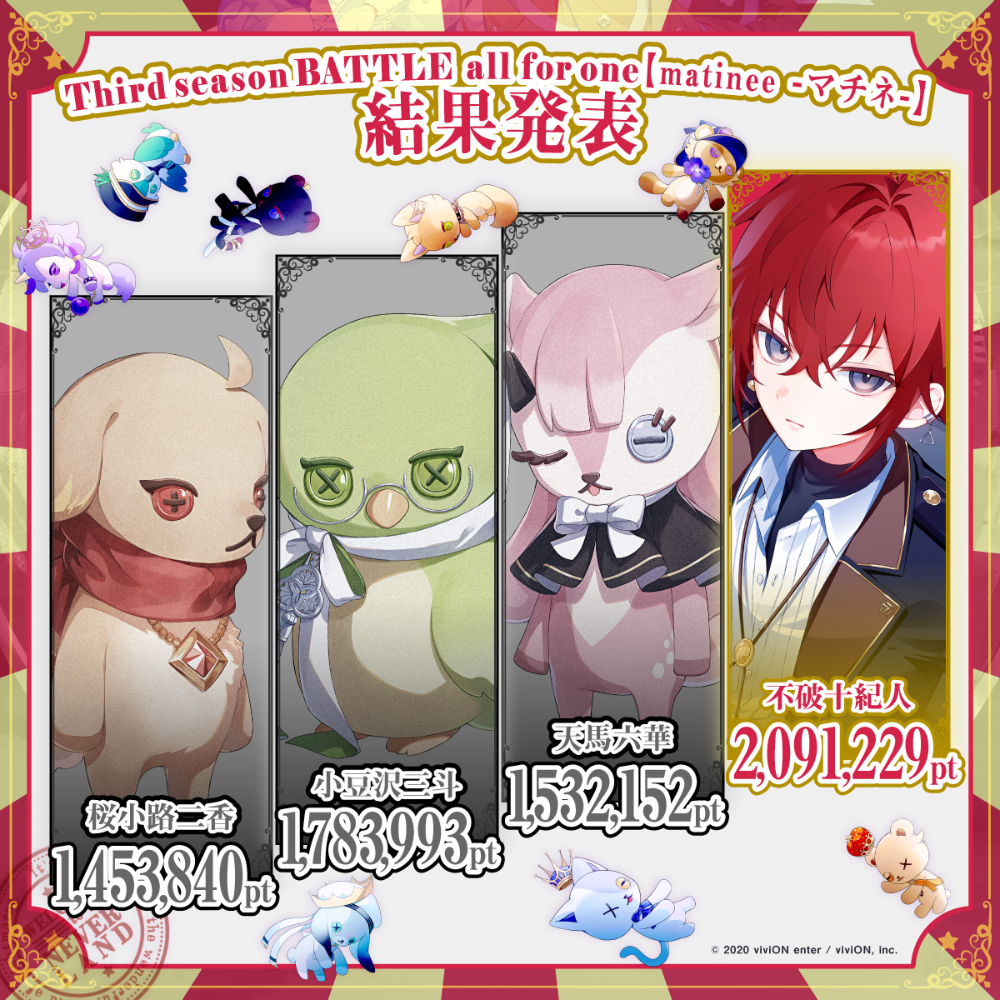
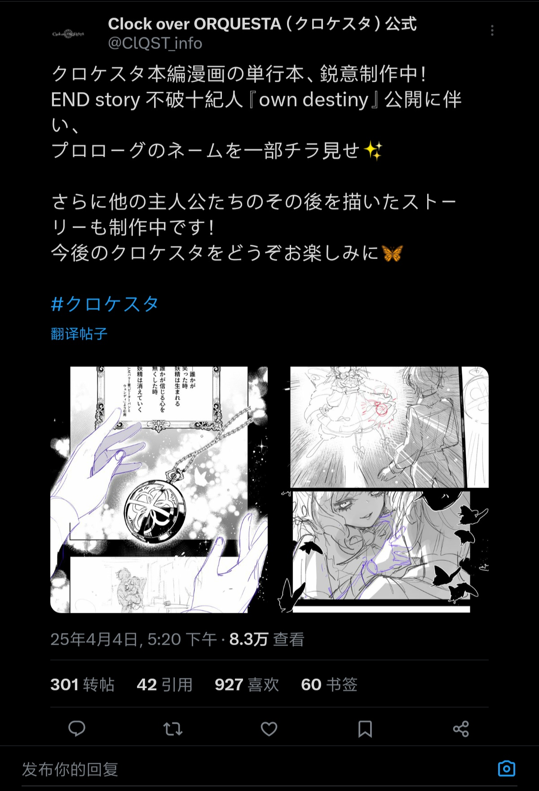
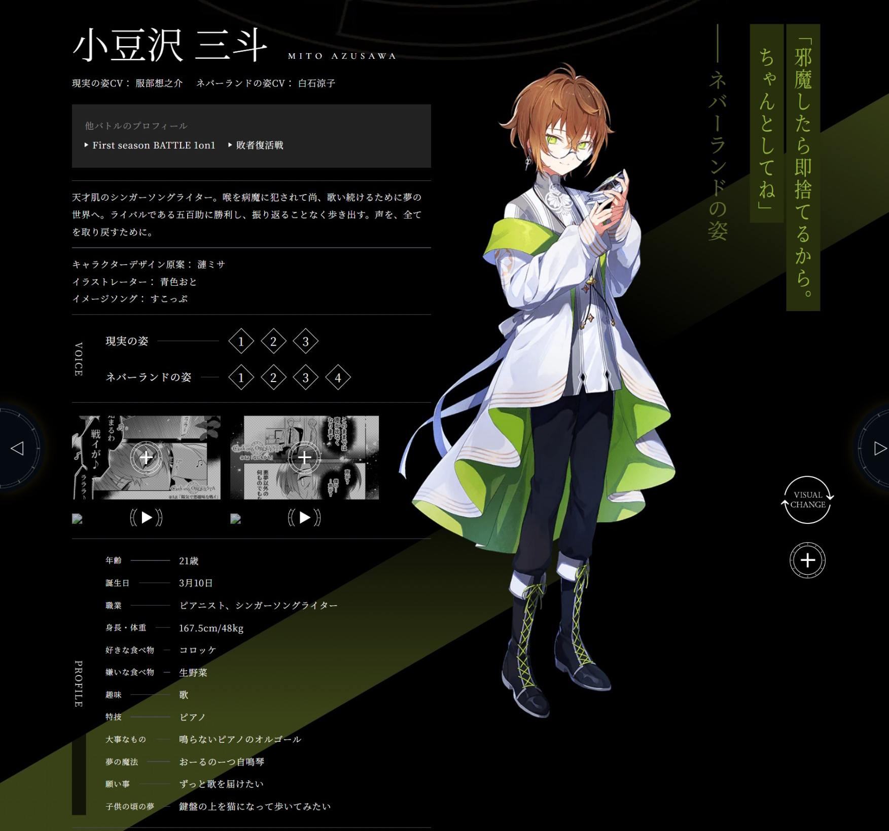
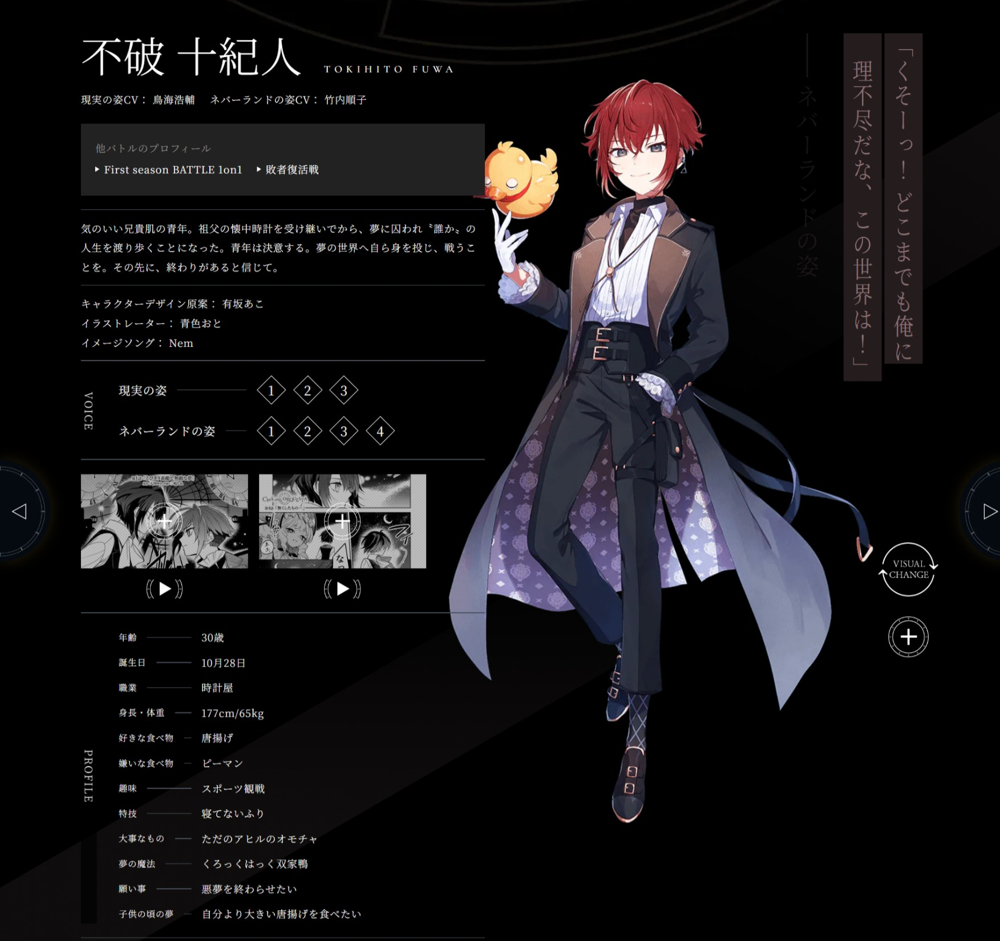
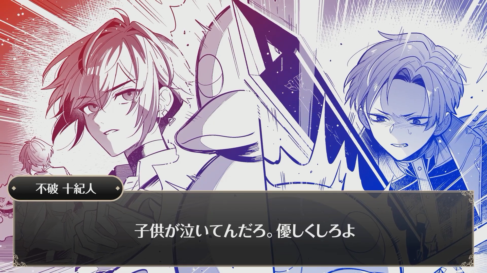
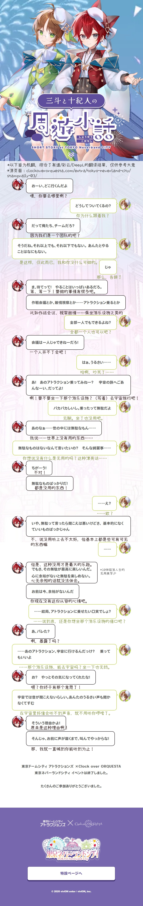
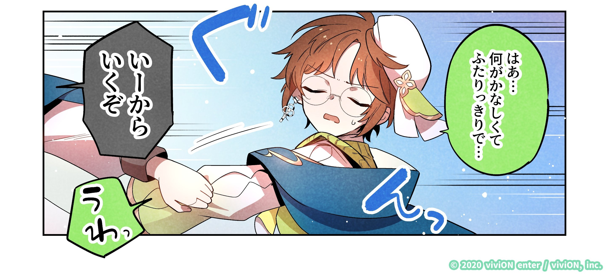
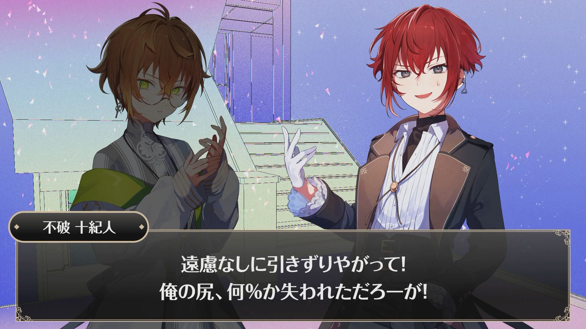
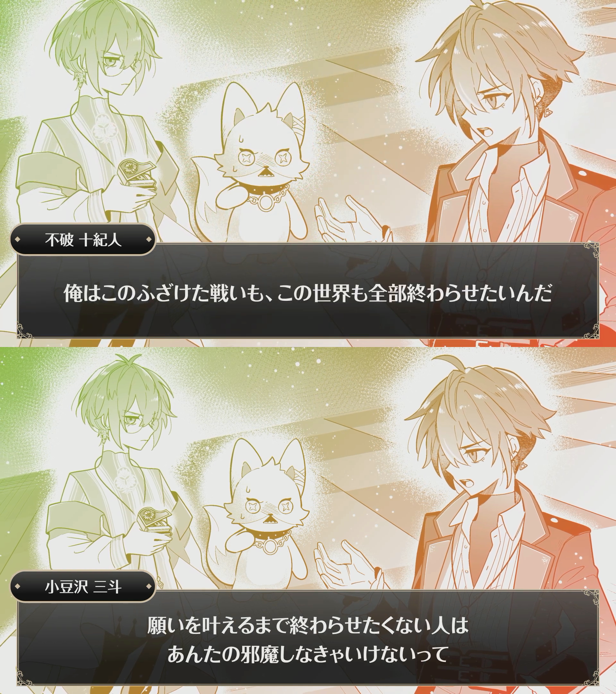

# 【圈外人也能看懂的 CLQST 310cb 向安利】绝症组友谊绝赞众筹中🎉  

# 食用说明

本文是 **CLQST 小豆泽三斗&不破十纪人 cb 向安利条**

~~(绝症组你们冷到让一个从来不会安利东西的人硬是搓了个安利条，实力)~~

 
图源：黑叉官号 Clock over ORQUESTA（クロケスタ）公式（@ClQST_info）

\*注：

- 因力图做到即便是对 CLQST 企划一无所知的朋友也能快速了解，所以下面对情节和人物形象的概述会比较宽泛和扁平。

- 角色和角色间关系更细微特别以及值得深挖的地方建议还是去翻原作细品，诚挚邀请各位一起无中生有绝症组友谊 ♩

- 本文含 [原作介绍](#原作介绍)/[角色介绍](#角色介绍)/[原作关系概括](#原作关系概括)/[角色关系萌点](#角色关系萌点)/[补习指南](#补习指南)，可按需阅读。

  - *由于此安利条作者还看不太懂结局（即end story）的操作，所以下边所述的内容基本是在描述三轮战斗开始前绝症组的关系状态*。

?> ⚠️**含【大 量 剧 透】**。

 
 
 
 

# 版权声明

此文档内容由非官方个人仅出于兴趣而制作，并未从中获取任何收益，所使用的图片仅用于更好地对 CLQST 企划及相关角色进行介绍说明，其版权为原作者 viviON enter / viviON, inc.所有。

此文档使用了“Clock over ORQUESTA”官方网站(<https://clockoverorquesta.com/>)的图片，相关图片禁止再利用（转载、发布等）。
 

!> **请勿将此文档的任何内容（尤其【补习指南】部分）以任何形式转载、发布于海外 sns 平台（如 X、Instagram、Facebook 等）。**

 
 
 
 

# 原作介绍

**Clock over ORQUESTA**（简称：CLQST/クロケスタ/ケスタ/钟），霓虹 sns 互动性
  sns 互动性说白了就是通过打投决定故事走向，可黑叉投票，但大头还是得通过买碟买周边等买买买投票。
大逃杀题材角色歌曲企划，cv 阵容豪华且部分曲目为术力口 P 供曲。

图源：CLQSTb 站官号 CLQST\_官方账号，BV1PQ4y1R7Cq

## 快速入门

- <b>本企 1 分钟速通介绍 ↓</b>
  虽然 24.11.02 官方更了新版视频，不过基本都是立绘和 cg 上的变动，问题不大<del>（毕竟Tink的介绍说明语音都没重配）</del>

  <iframe src="//player.bilibili.com/player.html?isOutside=true&aid=467641476&bvid=BV1eL411A7Df&cid=561003068&p=1&autoplay=0" scrolling="no" border="0" frameborder="no" framespacing="0" allowfullscreen="true" style=”width:100%;aspect-ratio:16/9;”></iframe>

- **官方入坑指南** →[初めての方、ようこそ！ クロケスタ入門ガイド](https://clockoverorquesta.com/extra/start/)

## 主线故事内容

主要内容是 12 位性格年龄各异的角色为实现愿望以正太形态在梦幻岛（Never↓and）进行魔法战斗的故事，角色存亡取决于现实打投结果。

虽是大逃杀题材但实际非常温和，并非什么你死我活的残酷厮杀，而是**角色在与其他角色的相处中于精神层面的成长历程。**

💡25.04.04 主线剧情已完结，目前（25年7月）漫画单行本制作中。

  
点击查看3rd BATTLE 结果

  
  图源：黑叉官号 Clock over ORQUESTA（クロケスタ）公式（@ClQST_info）

 

  
点击查看单行本相关官推情报

  
  图源：黑叉官号 Clock over ORQUESTA（クロケスタ）公式（@ClQST_info）
   

## CLQST企划动态获取渠道

- **官网** →[Clock over ORQUESTA【クロケスタ】](https://clockoverorquesta.com/)

- **官方sns账号：**

  - b 站 →[CLQST\_官方账号](https://space.bilibili.com/1759069692?)

  - 黑叉 →[Clock over ORQUESTA（クロケスタ）公式（@ClQST_info）](https://x.com/ClQST_info)

  - 油管 →[Clock over ORQUESTA（@ClockoverORQUESTA）](https://www.youtube.com/@ClockoverORQUESTA)

- **非官方搬运sns账号：**

  - 微博（已停更）→[CLQST 相关非公式主页](https://weibo.com/7550626387)

  - 微博（仅绝症组相关动态搬运）→[今 3 時 10 分](https://weibo.com/u/7987141372)

  - b 站 →[CLQST\_非公式搬运站](https://space.bilibili.com/1227895840)

 
 
 
 

# 角色介绍

## 小豆泽三斗

（角色名称后文以 3 代称）

现实年龄 21，拥有**魔鬼般毒舌特质的天才创作型歌手**，对音乐极度热忱，因我行我素的行事风格不太能和周围的人友好相处，通常表现出抗拒与他人交好的态度，但实际内心非常孤独，渴求与他人建立联系。

进入梦幻岛的原因是**喉咙受病魔侵袭且无法治愈**，今后没办法再继续唱歌，而音乐对他来说就是全部，为了能够再次歌唱而奋战至今。

现实形态 cv：服部想之介 / 梦幻岛形态 cv：白石凉子

角色印象曲提供：すこっぷ

图源：CLQST官网，<https://clockoverorquesta.com/character-secondseasonbattle/?c=03>
  

## 不破十纪人

（角色名称后文以 10 代称）

现实年龄 30，**脾气很好、非常豁达的钟表店老板**，从爷爷那里继承了一块老旧怀表后便开始了时不时会突发陷入昏睡（**嗜睡症**）的日子，游走于各种梦境（实际上是他人的人生），自己原本的生活变得支离破碎，逐渐分不清梦境和现实，为了夺回自己的人生而进入梦幻岛。

现实形态 cv：鸟海浩辅 / 梦幻岛形态 cv：竹内顺子

角色印象曲提供：Nem

图源：CLQST官网，<https://clockoverorquesta.com/character-secondseasonbattle/?c=10>
  

\*~~（八竿子打不着的）~~两人的共同点是身患不治之症，因此称为**绝症组**。

也可以称呼为 ↓

- **クレシェンテ組**（二轮战斗期间合唱曲「クレシェンテ」）

- **ハブられ組**（p 组抓剧情里相互吐槽）

- **熱ココア組**（一轮战斗分组投票）

- **🕒🕙コンビ**（combination 就是 combination 呀）

如果你愿意也可以叫 **炸物脑袋组**（3 喜欢可乐饼 10 喜欢炸鸡）

~~另外都有戴耳坠，是不是也可以称为耳坠组？~~

💡做饭可得绝症组友谊💪友谊造谣可见：

lft 相关 tag→ [绝症组友好日常](https://www.lofter.com/tag/%E7%BB%9D%E7%97%87%E7%BB%84%E5%8F%8B%E5%A5%BD%E6%97%A5%E5%B8%B8)，黑叉搜 →🕒 🕙
  貌似现在（25年7月）根据这个关键词搜不到什么相关了，如果你找到了新的有效搜索词请大力[戳我](https://www.lofter.com/message/c-sharp3)🙇感谢
。
 
 
 
 

# 原作关系概括

- **彼此立场相悖** 

→3 要实现愿望就得让游戏继续进行，10 要重回日常就得尽早结束游戏，但在游戏规则要求下不得不结盟。

  
点击查看原作对应部分剧情

  
  图源：油管官号 Clock over ORQUESTA（@ClockoverORQUESTA），【ストーリー動画】四話うるせぇよフツーはフツーだ（二轮二场战斗四话）

- **散装队友情** 

→ 区别于其他组的相亲相爱，绝症组散装基本贯彻始终。

组队主要是 3 拗不过 10 的哀求而勉强答应，但完全没把对方当回事——赛程绝大多数时间在 solo 塔塔开，就算后续终于碰头了也因立场不同而选择痛击队友。

  
点击查看33痛击队友

  
  图源：油管官号 Clock over ORQUESTA（@ClockoverORQUESTA），【ストーリー動画】五話みんな曲がらなかったらどうなっちゃうの（二轮二场战斗五话）

- **大叔带小孩** 

→ 虽然 3 全程我行我素还痛击队友，但 10 并不计较，出现状况第一时间伸出援手，超级温柔一大叔（泪目）

图源：油管官号 Clock over ORQUESTA（@ClockoverORQUESTA），【ストーリー動画】六話子供が泣いてんだろ優しくしろよ(二轮二场战斗六话)

❗ **补充：**

在这样的粗略概括下，3 在二轮二场战斗里的表现看上去有点任性妄为，但这实际上是因为 3 **过往长期处于不被理解和被排斥的人际关系造成。**

3 情绪不稳定是由于看到对手两位关系亲密以及和向来水火不容最后不欢而散的 5 重新相遇而陷入**情绪闪回**。为了抵御过往不健康人际关系带来的创伤，依赖于“战”和“僵”反应机制，即**通过发怒和躲避来获得安全感**，具体对应剧情里突发性的歇斯底里和对他人的疏离。

总之 3 身上有很多可以细说的东西，但目前 3 涉及的话题基本是我知识盲区，所以一时半会没办法说清楚……非常建议各位亲自去看看 3 相关，他身上关于**人际关系**的命题很有意思！
 
 
 
 

# 角色关系萌点

*一图速通绝症组萌萌日常互动模式→
<del>如下x</del>

 
  
  
请戳这里✔️

   
   图源：CLQST官网，<a href="https://clockoverorquesta.com/extra/tokyo-neverland-city/stamprally-03" target="_blank">https://clockoverorquesta.com/extra/tokyo-neverland-city/stamprally-03</a>

- **经典没头脑和不高兴搞笑组合** →10 装傻役，3 吐槽役（不绝对）

- **猫狗搭配冷热互补**（虽然官方动物塑 3 是鸟 10 是狼，但为了好懂就以猫派狗派概括了）→ 热脸贴冷屁股日常，10 热 3 冷

总之是 10 兴致高涨硬拉着 3 一起坐旋转茶杯 ↑[\*熟](https://moyesiyinyi.lofter.com/post/3123e50c_2bb9b4d27) 
图源：黑叉官号 Clock over ORQUESTA（クロケスタ）公式（@ClQST_info），3 周年記念ぷちクロケスタ『素敵で楽シイ遊園地～三斗&十紀人編～』

- **薛定谔的队友情** → 通常很散装，但必要的时候也可以很有团魂
  
 
    
二轮二场战斗最终战两人通力合作 (点击展开)

    
     图源：油管官号Clock over ORQUESTA（@ClockoverORQUESTA），【ストーリー動画最終話】まだ終わらないよ終わってあげない（二轮二场战斗最终话） 

- **炸物脑袋** →3 喜欢可乐饼，10 喜欢炸鸡，都是口感酥脆的炸物 ♩

- 绝症组对待自身不治之症的两种**截然不同**的态度 →3 难以接受，10 坦然处之

 

**区别于一般冷热反差搞笑组好磕的地方就在于 3 真的是特别毒舌的类型，吐起槽来呛死人不偿命。**

→ 在其余人迅速决定好组队对象，10 只能尝试拉拢打算无视规则单飞的 3 时，3 的第一句话是“怎么？被排挤了吗？”

[坐标00:19](https://weibo.com/7550626387/Od01vuWzu) 请听🤲

**10 是实力搞笑男，一出场空气就充满了快活的气息，凭一己之力承包了本企二轮二场战斗的所有笑点。**

→ 失去行动能力的 10 被拖到了 3 所在的地方，队友间的久别重逢寒暄 ↓

图源：油管官号 Clock over ORQUESTA（@ClockoverORQUESTA），【ストーリー動画】五話みんな曲がらなかったらどうなっちゃうの（二轮二场战斗五话）
  

**因为立场不同，两人短暂的和平共处状态随时可能崩盘，上一秒插科打诨，下一秒剑拔弩张，这种亦敌亦友的暧昧状态很有意思。**

以及在 clqst 的主线背景下，他俩无论谁能够实现愿望对另一位来说都非常残酷，他们之间只有非此即彼的结局吗？是否存在更好的解法？能否在对立的局面取得一个平衡点？两位关系的后续走向就有了大量的想象空间。

图源：油管官号 Clock over ORQUESTA（@ClockoverORQUESTA），【ストーリー動画】五話みんな曲がらなかったらどうなっちゃうの（二轮二场战斗五话）

 
  
  
作者本人对绝症组关系的主观理解

!> 作者已沉浸在自己的艺术里

  
3作为天才怪人一直不被周围人理解，而普通人确实难以理解天才的思维方式，但10经历过3的人生，则有更高的可能性能够理解3真正在经历什么，<b>从而更大概率能真正做到尊重和接纳3。</b>

  
而且截至目前二轮二场战斗的剧情里的互动来看，10是没有给3下“天才”或者“怪人”的定义的——也就是说在</b>10眼里，3就是3本身。</b>

  
另外10年纪更大，也经历了不同人的形形色色的人生，人生阅历更丰富，思维会更为开阔，很适合作为引导他人的成熟角色。

  
10的内核相当稳定，他是有余力消化来自3的投射并提供正向的心理支持的（更新3旧有的不安全人际经验）。而在这种真正的包容和支持下，3才有可能真正做到接受“并非所有人都能理解自己”以及“与人产生联系并非是痛苦的，他人不一定即地狱”的事实。

  
而且这样的行为本身就是如何去尊重和理解另一相异个体很好的参考，由此3能慢慢间接习得与他人相处的恰当方式。

  
此外面对突发坠入谷底的人生，3是痛苦抗拒的，更倾向于被动抵御变化；而10能坦然接受现状（在p组抓里还有心情以自黑的方式概括自己目前为止的人生），更倾向于主动去改变状况。

  
两种不同人生态度的相互碰撞可以延伸出一些更深度的东西，有很多可供发散的空间。

  
3是孤立的，相对于更容易从关系中获得社会支持的10而言，面对重大变故更容易陷入崩溃无力的境地，缺乏接受现状的能力。<b>10的存在或许能让3感受到与他人的关系所带来的被支撑的安全感，从而尝试去打开自我。</b>

  
那么反过来，3对10意味着什么？

  
除天才而不平凡外，年轻而纯粹、<b>对某件事物满怀热情、拥有能倾注毕生的事业，是少有的能够自我实现的、闪闪发光的人生。</b>

  
尤其对于目前已经完全脱轨、被各式各样他人的人生所填满而自己的人生一片空白的10来说更是如此。

  
此外，3和10都游离在“通常”的人生之外，都同样体会到“和其他人不一样”所带来的疏离感和孤独感，就这点而言，他们是相似的。

  
这部分纯属个人过度解读，所以点到为止，具体要怎么理解绝症组关系还请自行根据原作思考:D

   
  
🚧关于后续三轮战斗部分的个人主观理解：
   总有一天会写的.jpg

    

# 补习指南

## 相关剧情整体补习逻辑

**主线剧情按时间先后顺序为：**

- **前日谈**（前篇，角色来到 n↓ 前的经历）/**s1 角色单曲抓**（角色来到 n↓ 的契机）/**闲话**（角色的愿望）
- **s1**
- **幂间**（s1 胜者后话）
- **败者复活战 结果发表**/**f-forte**（s2 参赛者碰面+规则介绍）
- **p-piano**（s2 分组协商）
- **s2 2on2 2nd**
- **s3 battle all for one**

*但实际上叙事挺轻量且碎片化，所以即便不严格按照此顺序来也没关系，怎么高兴怎么补就是。

## 相关剧情&角色歌内容获取途径

- 目前剧情更新形式有**漫画、类文字 avg 形式的视频和抓**，相关内容获取途径：

  **漫画/视频** →<https://clockoverorquesta.com/story>

  **抓** → 实体发售 cd（已发行 cd 一览 →<https://clockoverorquesta.com/music/>）/流媒体（wyy/Apple Music/Spotify/YouTube Music/amazon music/LINE MUSIC/mora/レコチョク）

  国内相关内容搬运及烤请自行于各种 sns 搜搜关键字，漫画烤汇总可移步 → 非官方CLQST交流群
  门牌号：1034742641
  

- **角色歌相关：** 

<table style="TABLE-LAYOUT: fixed; WORD-BREAK: break-all;">
<thead>
<tr>
<th>角色</th>
<th>专辑(截至25年7月)</th>
<th>歌名</th>
<th>备注</th>
</tr>
</thead>

<tbody>
<!-- 3part -->
<!-- 合并单元格后需把空白格删掉，否则内容会错位 -->
  <tr>
    <td rowspan="5" >3</td>
    <td>一专</td>
    <td>ダイサンシャ</td>
    <td rowspan="10">*掰 = battle *一专、二专和二掰单曲有p主参与作曲编曲（冷知识：二掰及三掰的单曲由信号P负责混音）； *国内流媒体上线情况：全部cd均已在apple music上线，wyy/q音目前缺一掰角色单曲，未上线角色单曲可于wyy播客<a href="http://music.163.com/radio/?id=959567367" target="_blank">【Clock over ORQUESTA】</a>试听; *未附带歌词烤的曲目在wyy已有老师烤了</td>
  </tr>

  <tr>
    <td>一掰角色单曲vol.7 cantabile</td>
    <td>雑音輪舞曲（<a href="http://music.163.com/dj?id=2499639424" target="_blank">全曲熟</a>）、ダイサンシャ(Never↓and ver.)</td>
  </tr>

  <tr>
  <td>二专</td>
  <td>スリーワイズ</td>
  </tr>

  <tr>
  <td>二掰</td>
  <td>クレシェンテ</td>
  </tr>

  <tr>
  <td>三掰</td>
  <td>まちがいさがし（<a href="https://www.bilibili.com/video/BV1YXCAYjELy" target="_blank">全曲熟</a>）</td>
  </tr>

<!-- 10part -->
  <tr>
  <td rowspan="5">10</td>
  <td>一专</td>
  <td>ナルコレプシー No.10</td>
  </tr>

  <tr>
  <td>一掰角色单曲vol.11 portando</td>
  <td>夢迷トラベラー（<a href="https://www.bilibili.com/video/BV19B4y117vK" target="_blank">试听部分熟</a>）、ナルコレプシー No.10(Never↓and ver.)</td>
  </tr>

  <tr>
  <td>二专</td>
  <td>Wa十chmaker</td>
  </tr>

  <tr>
  <td>二掰</td>
  <td>クレシェンテ</td>
  </tr>

  <tr>
  <td>三掰</td>
  <td>I know You.（<a href="https://www.bilibili.com/video/BV14pC5YiEGJ" target="_blank">全曲熟</a>）</td>
  </tr>

</tbody>
</table>
 

## 三分钟速通指南

*给大忙人看的版本*

**【生】主线部分** → [BV1Rx4y1t7MY](https://www.bilibili.com/video/BV1Rx4y1t7MY)（空降 10:11 和 16:30）

**【机翻】番外部分** → [三斗&十纪人周游小话](media/img/【终】周游小话310移动版_clockoverorquesta.com.png)
 

## 系统补习指南

1. **角色声线速览**

  3→【熟】[BV1ukR9YjE6u](https://www.bilibili.com/video/BV1ukR9YjE6u)

  10→【熟】[BV1mp4y1H7MU](https://www.bilibili.com/video/BV1mp4y1H7MU)

2. **【熟】一轮战斗开篇、4th 和 6th 战斗有声漫**

  开篇（迅速了解各角色+世界观）→[BV19N411t7nb](https://www.bilibili.com/video/BV19N411t7nb)、[BV1GT4y187Nq](https://www.bilibili.com/video/BV1GT4y187Nq)

  4th（小豆泽三斗 vs 音叶五百助）→[BV1Aw411a79b](https://www.bilibili.com/video/BV1Aw411a79b)

  6th（不破十纪人 vs 朱鹭灯零士）→[BV1BR4y1C7Gu](https://www.bilibili.com/video/BV1BR4y1C7Gu)

3. **【熟】前日谈（前篇，角色来到 n↓ 前各自的经历）**

  3 篇 →<https://weibo.com/5239999049/4600299241342491>

  10 篇 →<https://weibo.com/5239999049/4664739840659492>

4. **【生】一轮战斗 3 和 10 个人抓（角色来到 n↓ 的契机）**

  3 抓-小豆沢三斗【cantabile － カンタビレ －】→apple music 等流媒体渠道（有余力可搭配 5 抓食用 →【熟】[BV1HixWeoEy2](https://www.bilibili.com/video/BV1HixWeoEy2)）

  10 抓-不破十紀人【portando － ポルタンド －】→[BV1Ch411N727](https://www.bilibili.com/video/BV1Ch411N727)

5. **【熟】闲话（角色的愿望）**

  3 篇 →<https://anziyoumengdaojinggukai.lofter.com/post/3195c702_2b56b43a3>

  10 篇 →[BV1WW4y1M7bp](https://www.bilibili.com/video/BV1WW4y1M7bp)

6. **【生】幂间漫画 3 和 10 编（一轮战斗后胜出角色的相关经历）**

  3 篇 →<https://weibo.com/7550626387/4827065214306253>

  10 篇 →<https://m.weibo.cn/status/4828867372519196>（【熟】→ 非官方CLQST交流群
  门牌号：1034742641
  ）

7. **二轮战斗开端**

  - 【熟】败者复活战 结果发表（二轮参赛者碰面+规则介绍）→<https://bilibili.com/opus/757505306372603927>

  （lft 源：1<https://dplemon-kou.lofter.com/post/3c8465_2b82b10b7>、2<https://dplemon-kou.lofter.com/post/3c8465_2b82b36e9>）

  - 【生】f-forte（二轮规则介绍+二轮参赛者自我介绍）+p-piano 抓（分组自行协商）→ wyy/阿 b

    - f-forte→[BV1bn4y1X7fw](https://www.bilibili.com/video/BV1bn4y1X7fw)

    - p-piano→[BV1Rx4y1t7MY](https://www.bilibili.com/video/BV1Rx4y1t7MY)（空降 10:11 和 16:30）

  （*其实部分内容在二轮二场主线里有引用到，p-piano 的抓是主线里绝症组互动最有趣的一集，请一定要听听）

8. **【机翻】【番外】东京巨蛋城游乐园联动特典周游小话 3&10 编**（非常非常萌的绝症组日常互动，在此特别感谢菩萨心肠 5 推老师 T T） 
  [**东京 Never↓and CITY 周游小话 三斗&十纪人篇 part1**](media/img/【终】周游小话310移动版_clockoverorquesta.com.png)

9. **【熟】二轮二场 3&10 合唱曲「クレシェンテ/新月」**
  （个人理解为表现绝症组身陷绝境势必实现愿望的决心，很好听，请所有人都去听！） 
  → [wyy](http://music.163.com/song?id=2144026734)/[BV15142127JK](https://www.bilibili.com/video/BV15142127JK)/[BV11bTFeZE4K](https://www.bilibili.com/video/BV11bTFeZE4K)（目前翻到四版]翻译，感兴趣可以都看看） 

10. **【熟】二轮二场主线剧情 second season battle 2on2 2nd battle 1-7 话**

  1→  [BV1df421R72F](https://www.bilibili.com/video/BV1df421R72F)

  2→  [BV1pT421S7YY](https://www.bilibili.com/video/BV1pT421S7YY)

  3→  [BV1uiGSe1EjX](https://www.bilibili.com/video/BV1uiGSe1EjX)

  4→  [BV1Wzg9eGE3q](https://www.bilibili.com/video/BV1Wzg9eGE3q)

  5→  [BV1fxhUeMEF2](https://www.bilibili.com/video/BV1fxhUeMEF2)

  6→  [BV1eJbNeiEGW](https://www.bilibili.com/video/BV1eJbNeiEGW)

  最终话 →  [BV18Ti7eUEmG](https://www.bilibili.com/video/BV18Ti7eUEmG)

11. **【生】三轮战斗主线剧情 all for one【matinee - マチネ -】、one for all【soiree-ソワレ-】「7days」、END story 不破十紀人 『own destiny』**(all for one 2-6话特别特别好的🥰请看)

  官方 →<https://clockoverorquesta.com/story>

  搬运 →<https://m.weibo.cn/detail/5183307774170861>

感谢各位伟大的搬运和烤肉老师（鞠躬）
    

# 问题反馈

若文档出现兼容性问题/所表述的内容有误/引用的剧情音声内容需更新，请→[联系作者](https://www.lofter.com/message/c-sharp3)

虽然不一定能及时响应但总之会尽力完善的🙇
    