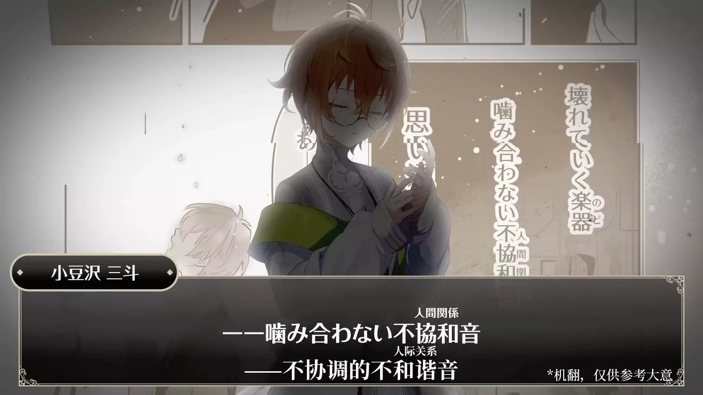

## 10是如何暂时打断3的创伤循环的？
 

\*存在大量剧透，s2p组抓和s3剧情全靠机翻硬啃，会有一定的理解偏差，<b>本质是完全沉浸在自己的艺术里的小作文，且我的观点=我的主观知觉≠事实本身≠要求你应该认同，请谨慎阅读</b>

\*本文直接引用的原作内容（文本及图内文本）皆为<b>机翻</b>，论述参考依据主要为互联网二手或n手传播内容，且本人无心理学专业背景，<b>下文对相关概念及理论的表述可能存在不准确之处，请注意甄别</b>

 

虽然还搞不懂主线结局的走向，但对我来说现有剧情（主线+番外）对于10如何暂时性地打断了3的创伤循环的处理意外地还挺好，整个过程用一句话概括就是——

**10持续表现出的耐受性(tolerance)使3的创伤循环得以暂时中断，并为其提供了一种新的、安全的关系体验。**

也就是说， 10在面对因自身内在的不安全感而采取挖苦、疏离态度的3时，不以同样具有攻击性的态度回击，能够积极持续接近、不吝提供关注和支持；在3自身情绪崩溃时能够始终保持平静，既不退避也不评判，不急于打断3的情绪表达，也没有对3置之不理，而是沉默地保持着关注，提供一种无压力的陪伴。

这样更多以非言语的方式所提供的接纳和联结能够避免唤起3过往人际互动经历的痛苦感受，同时暂时性地使3体验到人际关系与以往不同的、安全的一面，进而松动3根据自身过往经历所构建的“产生联系=遭受伤害”的认知以及基于此认知之上的过度防御。

接下来具体说明一下这个过程，同时也算是对之前整的绝症组安利条里我个人对绝症组互动的某些信口开河部分结合现有剧情内容进行展开：

> 10的内核相当稳定，他是有余力消化来自3的投射并提供正向的心理支持的。而在这种真正的包容和支持下，3才有可能真正做到接受“并非所有人都能理解自己”以及“与人产生联系并非是痛苦的，他人不一定即地狱”的事实。（进而可能更新3原有的不安全经验） 而10这样的行为本身就是如何去尊重和理解另一相异个体很好的参考，由此3能慢慢间接习得与他人相处的恰当方式。

 

**首先，10给3提供了恰到好处的支持。**

支持行为所发挥的效用不仅取决于提供支持的动机和支持行为本身在客观层面上能多大程度帮助到被支持者，还和支持行为与被支持者当前需要的匹配程度以及被支持者的个人偏好有关。

简而言之，恰到好处的支持便是在帮助对方达成目标、解决问题之余，还能以对方乐于接受的方式去帮。

**10允许3表达自己的感受而不做评判，不会给3带来与过往类似的“为什么不能像普通人那样”的心理负担，是对3本身很好的一种尊重和接纳：**

二掰二场六话里在3表露内心痛苦时10并没有去评判他的行为和感受，而是在一旁默默挡下来自8的攻击，为其提供情绪宣泄的空间。

在3和5的冲突接近尾声时，10依旧比较平静，同时沉默地关注着3的情绪状态——这个时候的10能够接受自己暂时未能理解3当下的强烈感受以及未能给3提供有效的解决办法的无力，尤其是在8&11抢先一步前往顶楼、局面已陷入劣势的情况下，依旧没有要求3应该优先考虑获胜以强行打断3的情绪表达，而是等到3重新冷静下来再说。

**而且从结果来看，10的支持行为没有唤起3过往关于人际关系的痛苦感受，反而还能帮助3平复心情，对3而言是受用的：**

二掰二场终话里与8＆11进行的战斗处在下风时，10把手搭在3的肩膀鼓励他不要放弃，使3心情安定下来。

并且10对3还表现出了一定程度的关心：在三掰六话里3详细说明把自己作为诱饵以营救2的计策时，10对此的反应是“那你怎么办\[\*お前はどうするなの\]”，以言语直接表达对3安危的担心。

 
原图来自：黑叉官号Clock over ORQUESTA（クロケスタ）公式（@ClQST_info），【Third season BATTLE all for one】 六話「裏切るかもしんないわよ〜？」

**10这种对3的需要表现出关注和支持的应答性(responsiveness)，在3所能接受的情况下为3提供了能够被尊重、被支持、积极正面的人际互动体验。**

 

**其次，10持续积极主动地以建设性的方式去维持与3的关系。**

关于前半句，10始终表现出维持关系的积极意愿：组队是10邀请3的。（好吧虽然本质是他没得选而且看3很不积极拉人所以推测能跟3组上队的机会比较大，但不管怎么说最后还是主动发起了邀请而不是被动地等自动凑一块，怎么不是一种积极意愿）

此外在番外里10总将他和3视为“同一个队”的整体去行动，而非两个完全分离的个体（和3的态度截然不同），并且试图通过一起玩各种游乐设施来增进关系。

即使3一而再再而三地打击10邀请他一起去玩的积极性（回避），但10依旧热情不减，还是会反复尝试拉3一起玩。

关于后半句，在绝症组的互动当中，10在面对3采取具有破坏性的应对时能更多地表现出顺应性行为(accommodative behavior)，即能够容忍来自关系中另一方的破坏性行为（对关系中另一方造成伤害、损害关系质量的行为），保持冷静并以建设性的方式（有助于维护关系的方式）回应，而非同样采取破坏性行为进行还击。

就算10在二掰里因立场不同而差点惨遭3不留情面的攻击、主动帮助变成玩偶的3恢复原状却被猛地一把推开、在三掰里救下了行动不便的3却被嫌弃多管闲事，10也没有表现出任何诸如“对方真是不可理喻”的愤怒或不满，依旧会在第一时间帮助3。

**而10的这种顺应性——不会轻易被对方的破坏性应对方式所影响，能够保持自身稳定、持续地进行建设性回应，便是使3过往创伤经验循环得以暂时中断的最重要因素。**

 

过往各种无法得到回应、不被理解、被排斥的人际互动经历塑造了3对人际关系极度消极的核心预期：他不可能被别人理解，因而无法被他人接纳，只会被视作异类，与人建立联系总是痛苦的。

 
原视频截图来自：油管官号Clock over ORQUESTA（@ClockoverORQUESTA），【ストーリー動画】一話「悪く思わんでくださいね」

为了避免这样的痛苦，3在无意识中依赖于两种防御性的应对方式：

一方面采取回避，压抑自己被他人认可和接纳的需要，表现出拒绝和他人接触的态度，避免让自己进入到关系当中（解决不了问题就解决问题本身），以至于3就算为了能够重新唱歌可以付出一切代价\[\*依据是钟官网角色介绍页音声，文本为机器转写结果：音楽を奪われるくらいなら、なんだってできる。\]，但在二掰明确要求组队时还是难以妥协，执拗地坚持要独自战斗。

另一方面依赖于分裂这一防御机制，也就是以非黑即白的态度去看待人际关系，认为关系要么是完全好的——彼此之间完全相互理解，能够相互接纳；要么是完全坏的——彼此之间根本无法互相理解，完全无法互相接纳。

3这样的信念直接体现在二掰二场六话3在与5的争执当中所说的“反正也理解不了！从一开始就放弃反而更轻松！”\[\*どうせ理解できないんだ！最初から諦めていた方が楽だった！\]以及钟官网角色介绍页音声“不要进入我的世界。既然无法互相理解，那就一直一个人就好。别管我。”\[\*文本为机器转写结果：僕の世界に入ってくるな。どうせ分かり合えないんだったら、ずっと一人でいい。ほっといてくれ。\]。

但能否建立被他人所接纳的联系并不绝对取决于相互理解或者彼此相似的程度，它会受个体的依恋类型（主要由早期与养育者的关系状态所塑造的个体对人际关系的适应性行为）、人格特质、沟通能力（多大程度能准确理解对方意图、表述自身意图以及做到良好倾听）、自尊水平以及关系信念（认为关系应该是什么样的）等各种因素的影响。

即使彼此并不了解对方，也可以产生接纳，比如3抓当中3在路上偶然碰到的粉丝因为喜欢他的作品而表现出对他本人的欣赏。

虽然这是一种单向的、有限的接纳，即这位粉丝所接纳的是基于作品之上掺杂了她个人理想化的幻想成分而构建出的3的形象，但3作为创作者通过作品所表达的东西确实传达到了，此时他的“希望有人聆听自己创作的乐曲”的强烈渴望\*得到了回应。\[\*来自官方3抓剧情简介，原文为：“自身の生み出した曲を聞いてほしい”という欲求をよすがに\]

如果说这只是一种有条件的、浅层而脆弱的接纳，而3本质上希望得到的是更深度的接纳，那么10并不清楚3身为天才创作型歌手的这一面（准确地说是暂时没有关联起来），且3在与10的互动中呈现出来的形象基本就是他的真实自我（互动中不加掩饰地表现出自身具有攻击性和不稳定的一面），这样的情况下10会把3和他自己视为一个整体并即便遭到疏离的情况下也依旧主动维持着联系，就接近于3所渴求的对他真实自我的完整接纳。

 

但很残酷的是，3自身有重复过往所经历的让自己陷入痛苦的关系模式的倾向——3自身的消极预期和错误信念这两者与创伤经历互为因果，形成了创伤循环：

由上面所提到的过往不良人际互动经历而形成的消极预期以及对人际关系的错误信念一方面促使3在无意识中引导他人表现出与过往经历类似的破坏性行为；另一方面又会促使3更多地注意到关系中给他带来伤害的部分以验证原有的负面预期，进而促成或强化了与过往经历相似的因关系而受伤的痛苦体验。

 
原视频截图来自：油管官号Clock over ORQUESTA（@ClockoverORQUESTA），【ストーリー動画】六話「子供が泣いてんだろ優しくしろよ」

**要打破这样的创伤循环，便需要体验一些好的、能够提供支持的、安全的人际关系，以重新满足过往创伤体验中未被满足的需求，从而推动个体能够有能力去觉察让自己陷入痛苦的过往关系模式，进而使其原先已停滞发展的爱人与被爱的能力得以重新发展。**

这就类似于，看见一个怕水的人溺水首先要做的事就是把对方捞上岸，等他脱离生命危险之后才说得上搞清楚对方为什么害怕水以及帮助他未来某天能够学会游泳，而不是在对方还在水里恐惧着、痛苦地挣扎时让对方不要害怕并要求他试着手脚划拉努力游上岸或者问对方为什么会怕水。

在3周年番外漫画\[\*素敵で楽シイ遊園地～三斗&十紀人編～\]和周游小话里虽然3一开始只是勉为其难地答应和10一起玩各种游乐设施，但到最后其实还挺乐在其中的。

这种被他人视为整体的一部分（一个队的队友）的被接纳的体验、在整个互动过程中能获得乐趣的体验，能够在3感到安全的情况下影响3对人际关系的认知。

**当然这种认知（以及应对模式）的转变不是一蹴而就的，而是需要持续的、好的体验所带来的积极正面感受（“产生联系=安全”）反复去覆盖过往创伤体验（“产生联系=伤害”）所带来的影响。**

在3的视角，就算10反复被自己推开，但还是没有选择离开（不抛弃），也不会把自己视为异类（不对3的存在本身进行评判），总是持续不断地接近、一次次向自己伸出手（提供稳定的联结感），最后来自10的这种持续稳定、安全的回应能逐渐获得3的信任，帮助他重新建立起对人际关系的积极信念。

 

三掰六话里3踢飞罐子倒地后，面对愤怒的Tink逼近而无力逃脱时，3表现出来的这种“接受了自己孤立无援的处境从而放弃挣扎”的无奈背后是他迫使自己放弃有人会来救自己的期待，再度压抑自己内心与他人联结的渴望，最终陷入一种被隔绝在外的、孤独的状态当中。

但这个时候10再一次赶到救下了3。

 
图源：黑叉官号Clock over ORQUESTA（クロケスタ）公式（@ClQST_info），【Third season BATTLE all for one】 六話「裏切るかもしんないわよ〜？」 
\[\*希望所有人都能懂一下最后这个分镜的救赎感\]

即便3总采取拒绝或刻意疏远的态度，10也依旧愿意抛开立场、不求回报地第一时间去帮助3。

由此，3所秉持的因为不能相互理解而无法与人交好、与他人建立联系只会让自己受伤的消极预期被重重打破。

尽管10一点都不了解他，但总能义无反顾地来帮助自己，而且与10的相处给自己的感觉并不坏。

**即便自己事先反复将他人推开但最终还是没有被抛弃，此刻3真正感受到了被他人所接纳、具有支持性的关系所带来的安全感和信任感**，于是便释然地笑了。

 
原图来自：黑叉官号Clock over ORQUESTA（クロケスタ）公式（@ClQST_info），【Third season BATTLE all for one】 六話「裏切るかもしんないわよ〜？」

 

但即便是经历了一段具有支持性的关系，也不代表原有的防御行为会立刻完全消失，因此最后3还是以有些疏离的态度戏谑一句：“不是说要背叛吗？[*裏切るんじゃなかった?]”

而10的回应“根本没时间背叛啊！！\[\*裏切る瑕もなかったわ!!\]”，依旧没有对3本人此时看上去不太领情的态度的指责和不满。

虽然字面意思上是一路排除阻碍救走2又捞走3已经竭尽所能，但在商讨作战计划时吐槽可能会背叛的6和3应该一致对外，以及10一直试图拉拢其他人将目光放在这个可疑的世界本身、而非盲目遵从规则把其余参赛者视为敌人，表现出一种合作者而非竞争者的态度，这话可能也有“根本就没时间（去想）背叛的事啊”的含义。

扯远了，我的意思是**正因为过往经历所塑造的认知行为模式是持久稳定的，所以新的积极体验的提供者自身需要具有并保持较高的稳定性，**即具有健康的自尊水平并能维持恰当的自我边界，不会轻易因他人的不稳定、释放的负面情绪致使自身崩溃，而目前来看10很好地做到了这一点。

10的自我非常之健全，一方面体现在10和家人朋友关系很好，拥有良好的外部支持网络：10抓里10和爷爷关系很亲密、对于如何处置爷爷留下来的钟表店10爸完全尊重10的个人意愿、end story前篇提到“和学校的朋友们相处得也还不错\[\*学校の友達ともうまくやってたし\]”。

另一方面体现在主线剧情里10和其他人的互动过程中，他能够准确地将自身遭受的负面应对行为中他人的态度与事实本身分开，而不会单纯被别人的情绪牵着走。

比如在2被抓走面对6的指责时说的是“为什么怪我？\[\*いや何で俺のせい！？\]”，而不是“是我的错”这样转向对自身的攻击，或者“难道不是你的错吗”这样同样向对方释放攻击性的回应。

他是明白自己并不需要为2被抓走这件事承担所有责任的，并试图理解对方这样归因的动机。

<b>这样稳定的自我使10有能力持续表现出耐受性(tolerance)</b>，即10持续主动包容3在关系互动中的所表现出的破坏性行为以及所释放的强烈的负面情绪，能够接受自己无法立刻理解3或者马上解决他所遇到的问题的现状，不急于给出不成熟的建议，作为一个平静稳定的存在持续提供支持和接纳。

 

另外3在与10的持续互动过程中，重新获得被接纳、被尊重、与他人联结并获得安抚和平静的体验使3以往未被满足的情感需求得到满足，从而无形中促使3原先对关系的应对和处理方式会被10所影响，无意识表现出了模仿行为。

如上文所述，从二掰二场到三掰六话，在10多次为3带来被接纳、被尊重、情绪安抚和稳定联结的人际互动体验之后，最后三掰六话里3表现出一反常态的、具有利他性的、主动提出与他人协作的行为——提议把自己作为诱饵的这种转变，可能是这一过程的体现。

 
原图来自：黑叉官号Clock over ORQUESTA（クロケスタ）公式（@ClQST_info），【Third season BATTLE all for one】 五話「僕が囮になる」

虽然这有可能是3在自身失去一定的行动能力下为实现收益最大化的理性生存决策，但结合二掰二场时3固执地坚持单打独斗，从一开始就漠视组队和要找到队友一同抵达终点的规则，尤其是中途与10谈判破裂后直接发起内讧，而非优先为了实现收益最大化而暂时妥协以获得阶段性胜利的表现来看——对3而言，能够保持自己的自主性、维持自身良好感觉比得到客观上的最大化收益更为重要。

所以我倾向于认为3这里的行为转变更多的是一种内摄（introjection），即3不加选择地吸收并无意识模仿了10的利他行为。

在通常的回避和分裂的防御策略失效的情况下（表示拒绝但还是被反复接近、“产生联系=陷入痛苦”的负面预期被打破），多次被动地接受来自他人纯粹的、不带目的性的帮助，对3来说是陌生的、难以适应的情形，内摄这一防御机制能够帮助他处理内心的不安。

同时内摄的这种对外部内容的吸收是未能充分消化并将其融合为自我的一部分的，所以这种发生在无意识层面的转变3自己也一时半会无法认同：在面对一脸震惊的6和10时，他依旧表露出疏远的态度——以理性的、工具化的视角描述自己的动机（报恩/投桃报李），从而维持过往那种能让自己感到安全的和他人的距离感。

尽管3行事风格的这种突兀转变是无意识的、非持续性的，但它是实现根本性转变的一个初始过程。

假若绝症组能够长期持续进行互动，3在这种较为安全的关系当中能够不断地重复这样微小的转变过程并得到正向反馈，从而促使3能够将这样具有建设性地建立和维持联系的方式整合为自身的一部分，进而让这种能够接受与他人产生联系和依赖的转变变得稳定持续。

 

要使3可以完全摆脱过往创伤经历所带来的影响、拥有建立和维持关系的能力，仅依靠原作目前给出的这些3和10的互动体验当然是远远不够的。

目前剧情当中10所做的：为3提供了一个不对3进行评判、能够让3安全表达自身感受的空间，能够稳定不受影响地维持与3的联结，持续提供支持、表现出对3的接纳和关心，在3所能接受的情况下让3体验到人际互动的积极一面——

这些新的、安全的体验对3的影响依旧是有限的，要想把这些体验所带来的认知（关系是安全的、可恢复的：与他人产生关联并不会被误解或排斥、即便我主动破坏关系也依旧会有人愿意持续与我保持联结）固化并真正纳入心理结构当中还需要去大量重复经历这样的体验。

就像是第一次意外在茂密的草地上从原先划好的路中离开，走出了一条新的道路。一开始这条新路是留不下什么痕迹的，很容易因为草重新长回来而消失，而要想这条路能保留下来就需要反复地去走，经年累月持续不断，最终使这条新路得以稳定存在，不再需要费力去维护，随时都可以走通。

**所以10作为一个“稳定的存在”所提供的支持仅仅只是推动着3有朝一日能够有能力去处理自己的情绪、重新与他人建立联结的一个开始而已。**

**此外对自我情绪的觉察和处理终究还是3自己的课题，而这并不是一个纯粹被动的过程。**

在好的经验注入之余，3也需要主动觉察并允许自身内部的感受和需要存在，而非像以前那样继续对其进行否认和忽视，注意到自己目前对防御行为的依赖，从而去看到这些感受和防御行为背后的成因，逐渐接纳过往的创伤经历而释怀，并逐渐学习如何应对自己的内心感受和需要。

觉察是疗愈的开始，3在三掰六话里已经能正视自己内心的孤独感和与他人联结的需要，不再继续否认和压抑自己的真实情感需求，这是一个非常好的转变。

这种觉察也非常直接地体现在了3的三掰角色歌「まちがいさがし」的歌词里：

> 孤独に苛まれるなんて もう嫌なんだよ　逃げたくない

→非常直白地表露直面内心真实感受的决心。

> 本当の ここの 募る ばかり まちがいさがし 本当の ここの 募る ばかり 愛を知りたい まちがいさがし 本当の ここの 募る ばかり 愛を知りたい 通じ合いたい まちがいさがし

→副歌（？）层层递进，在坦诚面对内心孤独感的前提下，（相较于先前的角色歌）更为主动地尝试探寻原因，同时看见并尊重（允许存在并表达）自己的联结需求，不再进行对抗。

至于后边的要有意识去减少对安全行为的依赖、恢复现实检验力、内化新的安全的经验、从安全的弱联结开始逐渐适应和学习人际关系的处理等等接纳和改变的事情都是后话，总之还是需要时间。

但你也知道主线就这样在10还不知道3的全名、也不知道和3曾经有过一面之缘的情况下直接完结了，所以也就这样了。

  

**#本文参考：**

\-《亲密关系（第6版）》 \[美\]罗兰·米勒 译者：王伟平 人民邮电出版社，2015

\-《自体心理学导论》第三章 自体与自体客体、第五章 自体心理学如何看待心理成长和治疗行为 \[美\]彼得·A.莱塞姆 译者：王静华 中国轻工业出版社，2017

\-心理咨询中的容器功能：耐受性 - Dr.Wang的想法 - 知乎 https://zhihu.com/pin/1938937778911020811

\-你理解“非黑即白”吗？ ——心理治疗小辞典·021分裂 - 明见心理咨询中心的文章 - 知乎 https://zhuanlan.zhihu.com/p/145028849

\-常见的22种自我防御机制 ∣六度心理咨询 - 豆瓣 - https://site.douban.com/226886/widget/notes/15721025/note/325473386/

\-强烈负面情感下所感受到的东西往往是不真实的。-https://www.bilibili.com/video/BV1CH2QYkE6F

\-内射(introjects)内化(internalizing)内摄（Incorporation) Identification、Internalization、Introjection、Incorporation 在心理咨询和心理治疗中的具体含义 https://my.juguandian.com:8080/books/432ac/page/introjectsinternalizingincorporation#bkmrk-3.-introjection%EF%BC%88%E5%86%85%E6%91%84%EF%BC%89

\-科学理解并有效实施暴露治疗 | 直面恐惧 - 壹心理 https://m.xinli001.com/info/100471254

\-重塑思维：如何通过认知行为疗法克服负面思维 - 壹心理 https://m.xinli001.com/info/100493619
  